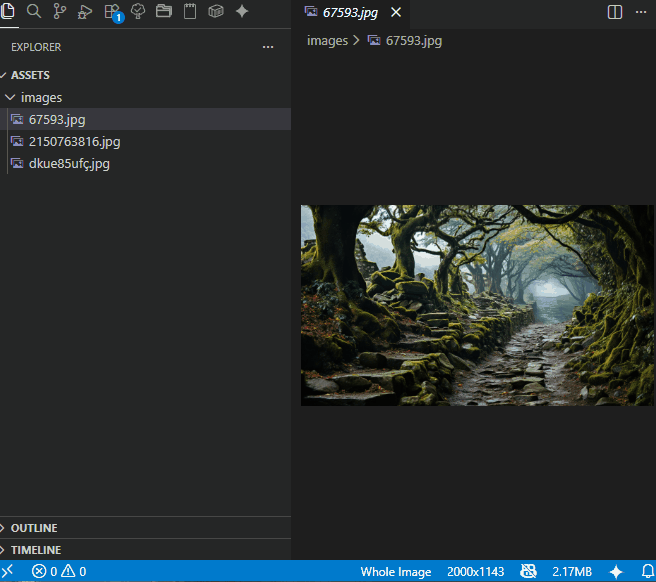
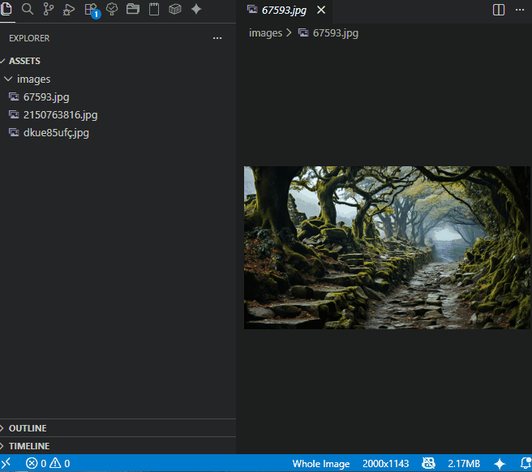

# Image Webify

 

Image Webify allows you to convert your images (JPG, PNG, GIF, TIFF) to WebP or AVIF formats directly from the Visual Studio Code Explorer context menu.

**Native support for Windows, macOS (Apple Silicon), and Linux included. No external dependencies required.**

## 📦 Features

* One-Click Conversion: Right-click any image and convert it instantly.
* Batch Processing: Select multiple images and convert them all at once.
* Parallel Performance: Uses parallel processing to handle multiple files at lightning speed.
* Smart Selection: Automatically filters out non-image files if you accidentally select them.
* Customizable Quality: Choose your compression level or set a global default in the settings.

## 📋 Usage

* Open the Explorer side bar.
* Right-click on one or more image files (.jpg, .png, .gif, .tiff).
* Select "Convert to WebP" or "Convert to AVIF".
* (Optional) Choose the desired quality if prompted.

Convert one image

Convert multiple images

## ⚙️ Extension Settings

This extension contributes the following settings:

* `image-webify.defaultQualityWebp`: default quality value for webp conversion (80).
* `image-webify.askForQualityWebp`: if true always ask for quality value for webp conversion (True by default). 
* `image-webify.defaultQualityAvif`: default quality value for avif conversion (80).
* `image-webify.askForQualityAvif`: if true always ask for quality value for avif conversion (True by default).  

You can tune them in Settings > Extensions > Image Webify

## 📝 Change Log
See Change Log [here](./CHANGELOG.md)

## 🚩 Issues
Submit the [issues](https://github.com/geckod22/vsc-image-webify/issues) if you find any bug or have any suggestion.

## 🤝 Contribution
Fork the [repo](https://github.com/geckod22/vsc-image-webify) and submit pull requests.

## 🛠️ Built With

* [Sharp](https://sharp.pixelplumbing.com/) - High performance Node.js image processing.
* [Visual Studio Code API](https://code.visualstudio.com/api) - For the seamless extension integration.

## 🔒 Privacy & Performance
All image conversions are performed **locally** on your machine using Sharp. No data is ever uploaded to any server.